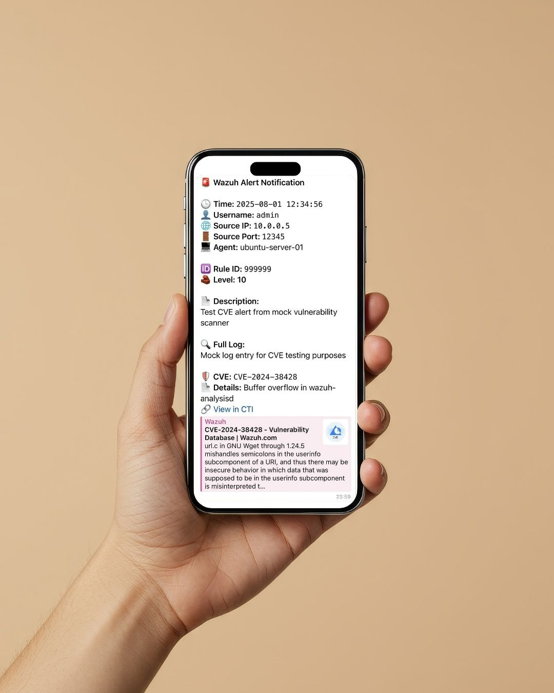

# Wazuh 4.12 Telegram Alert Integration (with SSH Login Alerts)


Wazuh is a robust open-source security platform, but it doesn't include native support for Telegram alerts. This guide walks you through a simple method to send alerts, like SSH login attempts, to Telegram using a custom integration script.



## 🛠️ Prerequisites

- A Telegram bot and your chat ID ([official guide](https://core.telegram.org/bots#6-botfather), or use the quick setup below)
- Wazuh 4.12 installed
- Basic Linux shell and Python knowledge

---

# How to Create a Telegram Bot

Creating a Telegram bot is quick and easy with Telegram’s official **BotFather**:

1. Open Telegram and search for **@BotFather**.
2. Start a conversation and send `/start` to begin.
3. Create your bot with the command `/newbot`.
4. Follow the instructions:
   - Provide a display name for your bot.
   - Choose a unique username that ends with `bot` (e.g., `WazuhAlertBot`).
5. BotFather will then return your **bot token**, which looks like this: `123456789:ABCdefGhIJKlmNoPQRstUVwxyz1234567890`.
6. Keep this token safe, it's required to send messages from your bot.

You can now find your bot on Telegram using its username and send it a message to start.

---

# How to Get Your Telegram Chat ID

To send alerts to Telegram, you'll need your **chat ID**. The script below fetches your chat ID by reading the latest message sent to your bot.

## Steps

1. Replace the `bot_token` in the script with the token you got from BotFather.
2. Send any message to your bot via Telegram (e.g., "hello").
3. Run the script below using Python.
4. Your chat ID will be printed in the terminal.

## Python Script to Retrieve Chat ID

```python
import requests

bot_token = ""  # Replace with your bot token

def get_chat_id():
    url = f"https://api.telegram.org/bot{bot_token}/getUpdates"
    response = requests.get(url)
    if response.status_code == 200:
        data = response.json()
        if "result" in data and len(data["result"]) > 0:
            # Get chat ID from the last message
            chat_id = data["result"][-1]["message"]["chat"]["id"]
            print(f"Your Chat ID is: {chat_id}")
        else:
            print("No messages found. Please send a message to your bot first.")
    else:
        print(f"Failed to get updates: {response.status_code}")

if __name__ == "__main__":
    get_chat_id()
```

---

## 📦 Step 1: Set up Python Virtual Environment in Wazuh

Create a Python virtual environment inside the Wazuh directory (`/var/ossec`) to avoid permission issues and package conflicts.

```bash
mkdir -p /var/ossec/venv
python3 -m venv /var/ossec/venv
source /var/ossec/venv/bin/activate
pip install requests  # or any needed packages
```

## 📁 Step 2: Create Telegram Integration Script

Name the script with prefix `custom-`.  
**Location:** `/var/ossec/integrations/custom-telegram.py`

```python
#!/var/ossec/venv/bin/python

import json
import re
import sys
from datetime import datetime

import requests

# Telegram Bot credentials
bot_token = "" # Replace with your Telegram bot token
chat_id = "" # Replace with your Telegram chat ID

# === Excluded Wazuh Rule IDs ===
excluded_rules: list = []  # Example: ["1002", "5715", "18107"]


def escape_markdown_v2(text):
    if not isinstance(text, str):
        text = str(text)
    # Escape special MarkdownV2 characters
    escape_chars = r"_*[]()~`>#+-=|{}.!"
    return re.sub(r"([%s])" % re.escape(escape_chars), r"\\\1", text)


def main():
    if len(sys.argv) < 2:
        print("[ERROR] No alert file path provided.")
        sys.exit(1)

    alert_file = sys.argv[1]

    try:
        with open(alert_file, "r") as f:
            alert = json.load(f)
    except Exception as e:
        print(f"[ERROR] Failed to read or parse alert JSON file: {e}")
        sys.exit(1)

    rule_id = alert.get("rule", {}).get("id", None)

    if rule_id in excluded_rules:
        print(f"[INFO] Skipping excluded rule ID: {rule_id}")
        sys.exit(0)

    # Extract fields
    data = alert.get("data", {})
    srcuser = data.get("srcuser") or data.get("dstuser") or "unknown"
    srcport = data.get("srcport", "unknown")
    srcip = alert.get("data", {}).get("srcip", "unknown")
    agent_name = alert.get("agent", {}).get("name", "unknown")
    alert_level = alert.get("rule", {}).get("level", "unknown")
    rule_id = alert.get("rule", {}).get("id", "unknown")
    description = alert.get("rule", {}).get("description", "No description")
    full_log = alert.get("full_log", "No full log available")
    timestamp_raw = alert.get("timestamp", "unknown")

    # Convert timestamp to human readable format (date and time to seconds)
    try:
        # Try parsing ISO8601 format
        dt = datetime.fromisoformat(timestamp_raw.replace("Z", "+00:00"))
        timestamp = dt.strftime("%Y-%m-%d %H:%M:%S")
    except Exception:
        timestamp = timestamp_raw  # fallback if parsing fails

    # Build message
    message = (
        "*🚨 Wazuh Alert Notification*\n\n"
        f"🕒 *Time:* `{escape_markdown_v2(timestamp)}`\n"
        f"👤 *Username:* `{escape_markdown_v2(srcuser)}`\n"
        f"🌐 *Source IP:* `{escape_markdown_v2(srcip)}`\n"
        f"🚪 *Source Port:* `{escape_markdown_v2(srcport)}`\n"
        f"💻 *Agent:* {escape_markdown_v2(agent_name)}\n\n"
        f"🆔 *Rule ID:* `{escape_markdown_v2(rule_id)}`\n"
        f"🧱 *Level:* *{escape_markdown_v2(alert_level)}*\n\n"
        f"📄 *Description:*\n{escape_markdown_v2(description)}\n\n"
        f"🔍 *Full Log:*\n{escape_markdown_v2(full_log)}"
    )

    vuln = alert.get("vulnerability", {})
    cve_id = vuln.get("cve", "")
    cve_title = vuln.get("title", "")
    cve_url = f"https://cti.wazuh.com/vulnerabilities/cves/{cve_id}" if cve_id else ""

    if cve_id:
        message += (
            f"\n\n*🛡️ CVE:* `{escape_markdown_v2(cve_id)}`\n"
            f"*📄 Details:* {escape_markdown_v2(cve_title)}\n"
            f"[🔗 View in CTI]({escape_markdown_v2(cve_url)})"
        )

    # Send to Telegram
    url = f"https://api.telegram.org/bot{bot_token}/sendMessage"
    payload = {"chat_id": chat_id, "text": message, "parse_mode": "MarkdownV2"}

    response = requests.post(url, json=payload)
    if response.status_code != 200:
        print(f"[ERROR] Telegram response: {response.status_code} - {response.text}")


if __name__ == "__main__":
    main()
```

## 🔧 Step 3: Create Shell Wrapper Script

Wazuh calls shell scripts, so create a simple wrapper to call the Python script. It should have the same name of the python file without the `.py` extension.
**Location:** `/var/ossec/integrations/custom-telegram`

```bash
#!/bin/bash
/var/ossec/venv/bin/python3 /var/ossec/integrations/custom-telegram.py "$@"
```

Make both scripts executable and set proper ownership:

```bash
chmod 750 /var/ossec/integrations/custom-telegram*
chown root:wazuh /var/ossec/integrations/custom-telegram*
```

## Step 4: Configure Integration in `ossec.conf`

- Ensure that `logall_json` is enabled by setting it to `yes` in your `ossec.conf` file:

```xml
<ossec_config>
  <global>
    <jsonout_output>yes</jsonout_output>
    <alerts_log>yes</alerts_log>
    <logall>yes</logall>
    <logall_json>yes</logall_json>
  </global>
</ossec_config>
```

- Add the integration block in `/var/ossec/etc/ossec.conf`:
- The `<name>` tag value (`custom-telegram`) must exactly match the name of your wrapper script.

```xml
<ossec_config>
  <integration>
      <name>custom-telegram</name>
      <level>7</level>
      <alert_format>json</alert_format>
  </integration>
</ossec_config>
```

Setting level to `7` means only alerts with level 7 or higher trigger the Telegram alert.

## 🔒 Step 5: Elevate SSH Login Rule Level in Wazuh

By default, successful SSH login events (SID `5715`) have a low alert level and do not trigger integrations. To resolve this, create or update the file `/var/ossec/etc/rules/local_rules.xml` with the following content:

```xml
<group name="local,syslog,sshd,">
  <rule id="100011" level="7" overwrite="yes">
    <if_sid>5715</if_sid>
    <description>sshd: Successful SSH login with elevated level.</description>
    <group>authentication_success,pci_dss_10.2.5,</group>
  </rule>
</group>
```

This configuration overrides the level of rule ID 5715 and raises it to level 7, ensuring it triggers and sends alerts to Telegram.

> 🔗 [Rules Syntax — Wazuh rule definitions and structure](https://documentation.wazuh.com/current/user-manual/ruleset/ruleset-xml-syntax/rules.html#rule)

After making these changes, restart the Wazuh manager to apply them:

```bash
systemctl restart wazuh-manager.service
```

## ✅ Step 6: Test the Integration

Test manually with an alert JSON file:

```bash
/var/ossec/integrations/custom-telegram /var/ossec/logs/alerts/alerts.json
```

Or wait for a real SSH login alert to be sent to Telegram.

## 🚀 Result

Receive real-time Telegram alerts for SSH logins and other critical events with detailed, nicely formatted messages, perfect for quick incident response.

If you found this useful or have questions, feel free to comment. Happy monitoring! 👨‍💻📱

---

_Created with ❤️ by [0xdolan](mailto:0xdolan@gmail.com)_
